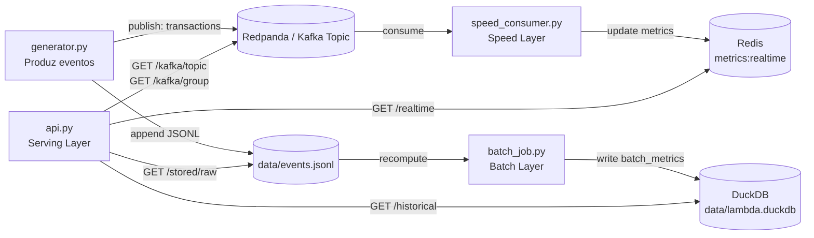

# Laboratório 4 — Arquitetura Lambda com Docker

Você deverá implementar e validar uma arquitetura **Lambda** simplificada, executando localmente com Docker.

## Arquitetura esperada:

`batch layer + speed layer + serving layer`

Contexto de negócio:
- Simular eventos de um e-commerce/fintech (`view`, `add_to_cart`, `purchase`, `cart_abandon`);
- Atualizar métricas em **tempo quase real** (speed layer);
- Recalcular métricas históricas por reprocessamento (batch layer);
- Disponibilizar consulta unificada por API (serving layer).

## Objetivos

- distinguir o papel de cada camada da arquitetura Lambda;
- explicar o trade-off entre latência e consistência histórica;
- executar reprocessamento histórico após mudança de regra;
- justificar quando usar Lambda ao invés de Kappa.

## Estrutura

Utilize a pasta `src/` com os arquivos base:

- `docker-compose.yml`
- `Dockerfile`
- `requirements.txt`
- `generator.py`
- `speed_consumer.py`
- `batch_job.py`
- `api.py`
- `README.md`

## Requisitos funcionais

1. Geração de eventos:
    - Publicar eventos em broker de mensagens;
    - Persistir eventos brutos em arquivo para reprocessamento.

2. Speed layer:
    - Consumir eventos continuamente;
    - Atualizar métricas de baixa latência (ex.: total de eventos, total de compras, valor total comprado, abandono de carrinho).

3. Batch layer:
    - Recalcular métricas históricas a partir do arquivo bruto;
    - Armazenar resultado em base analítica local.

4. Serving layer: Expor endpoints HTTP para:
    - Visão em tempo real;
    - Visão histórica;
    - Visão unificada Lambda;
    - Inspeção dos dados armazenados (arquivo bruto e batch store).

5. Observabilidade básica da fila:
    - Endpoint com informações do tópico Kafka/Redpanda (partições e offsets);
    - Endpoint com lag estimado do consumer group da speed layer.

## Como cada parte do código funciona

### 1) Orquestração dos serviços (`src/docker-compose.yml`)

O `docker-compose.yml` sobe seis serviços:

- `redpanda`: broker compatível com Kafka (fila de eventos).
- `redis`: banco em memória para métricas de baixa latência.
- `speed`: consumidor contínuo (speed layer).
- `api`: FastAPI (serving layer e endpoints de inspeção).
- `generator`: produtor de eventos sintéticos.
- `batch`: job sob demanda para recomputar histórico.

Fluxo entre containers:

- `generator` escreve no tópico `transactions` do `redpanda` e também em arquivo bruto (`/app/data/events.jsonl`).
- `speed` lê do tópico e atualiza agregados no `redis`.
- `batch` lê o arquivo bruto e grava métricas históricas no DuckDB (`/app/data/lambda.duckdb`).
- `api` lê `redis` + DuckDB + arquivo bruto + metadados Kafka e expõe tudo via HTTP.

### 2) Imagem base e dependências (`src/Dockerfile` e `src/requirements.txt`)

- `Dockerfile` usa `python:3.11-slim` para reduzir consumo de recursos no Codespaces.
- Instala bibliotecas necessárias:
  - `fastapi` e `uvicorn` (API)
  - `redis` (cliente Redis)
  - `kafka-python` (producer/consumer Kafka)
  - `duckdb` (camada batch local)

Todos os serviços Python reutilizam a mesma imagem, mudando apenas o comando (`generator.py`, `speed_consumer.py`, `batch_job.py`, `api.py`).

### 3) Geração de dados (`src/generator.py`) — ingestão

Função da camada:

- Simular eventos de negócio (`view`, `add_to_cart`, `purchase`, `cart_abandon`).
- Publicar cada evento no broker (tópico `transactions`).
- Persistir o mesmo evento em `events.jsonl` para reprocessamento posterior.

Detalhes importantes do código:

- `make_event()` cria payload com `event_id`, `user_id`, `product_id`, `event_type`, `amount`, `ts`.
- `connect_producer()` tenta conectar ao broker com retries (robustez em subida de containers).
- O `main()` controla volume (`EVENTS`) e ritmo (`SLEEP_MS`) por variáveis de ambiente.

### 4) Speed layer (`src/speed_consumer.py`) — tempo quase real

Função da camada:

- Consumir eventos continuamente do tópico.
- Atualizar contadores em Redis com baixa latência.

Métricas em `metrics:realtime`:

- `events_total`
- `purchases_total`
- `purchase_amount_total`
- `cart_abandon_total`

Detalhes importantes do código:

- `connect_redis()` e `connect_consumer()` possuem retries.
- `init_metrics()` inicializa o hash no Redis caso não exista.
- `process_event()` usa pipeline Redis para atualização atômica e eficiente.
- Consumer usa `group_id=speed-layer`, permitindo medir lag por grupo.

### 5) Batch layer (`src/batch_job.py`) — recomputação histórica

Função da camada:

- Ler o histórico bruto (`events.jsonl`) e recomputar métricas completas.
- Gravar resultado consolidado na tabela `batch_metrics` em DuckDB.

Consulta principal:

- Conta eventos totais.
- Soma compras e valor total de compras.
- Conta abandono de carrinho.
- Captura timestamp do último evento (`last_event_ts`).

**Mesmo que a camada speed tenha falhas momentâneas, o batch permite reconstruir o estado histórico correto.**

### 6) Serving layer (`src/api.py`) — consulta e inspeção

A API expõe três grupos de endpoints:

#### a) Métricas Lambda

- `/realtime`: lê métricas da speed layer no Redis.
- `/historical`: lê métricas batch no DuckDB.
- `/lambda-view`: retorna visão unificada `{historical, realtime}`.

#### b) Verificação de dados armazenados

- `/stored/raw?limit=20`: devolve amostra dos últimos eventos persistidos em `events.jsonl`.
- `/stored/summary`: resume estado de armazenamento:
  - arquivo bruto (existe, tamanho, linhas)
  - base batch (existe e métricas históricas)

#### c) Observabilidade da fila Kafka/Redpanda

- `/kafka/topic`: mostra partições, `begin_offset`, `end_offset` e estimativa de mensagens por partição.
- `/kafka/group`: mostra offsets commitados do grupo `speed-layer` e `lag_estimate` por partição.

Esses endpoints ajudam a validar:

- se os dados estão entrando na fila,
- se estão sendo consumidos,
- e quanto ainda falta processar.

### 7) Fluxo completo (fim a fim)

1. `generator` cria e publica eventos + grava em arquivo bruto.
2. `speed_consumer` processa em tempo real e atualiza Redis.
3. `batch_job` reprocessa histórico e grava no DuckDB.
4. `api` permite comparar estado em tempo real vs histórico e inspecionar fila/dados.

### Diagrama



Esse desenho implementa, na prática, o princípio da arquitetura Lambda:

- **Speed layer** para resposta rápida;
- **Batch layer** para exatidão histórica e reprocessamento;
- **Serving layer** para consumo unificado.

## Execução

1. Subir serviços principais:

```bash
cd src
docker compose up redpanda redis speed api
```

2. Gerar carga de eventos (em outro terminal):

```bash
docker compose run --rm generator
```

3. Executar batch/reprocessamento (em outro terminal):

```bash
docker compose run --rm batch
```

4. Validar saídas:

- `GET /realtime`
- `GET /historical`
- `GET /lambda-view`
- `GET /stored/raw?limit=20`
- `GET /stored/summary`
- `GET /kafka/topic`
- `GET /kafka/group`

## Extra

- Simular mudança de regra (ex.: nova fórmula de métrica);
- Reprocessar histórico e comparar resultado antes/depois;
- Discutir impacto operacional da duplicação de pipelines na Lambda.
