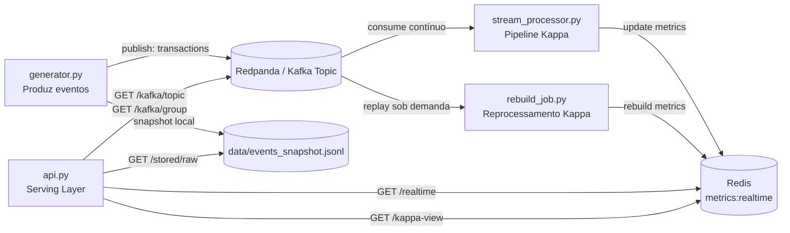

# Laboratório 5 — Arquitetura Kappa com Docker

Você deverá implementar e validar uma arquitetura **Kappa** simplificada, executando localmente com Docker.

## Arquitetura esperada:

`event log único + processamento contínuo + serving layer`

Contexto de negócio:
- Simular eventos de um e-commerce/fintech (`view`, `add_to_cart`, `purchase`, `cart_abandon`);
- Atualizar métricas em **tempo quase real** por stream processing;
- Reprocessar estado por **replay do log de eventos** (sem pipeline batch separado);
- Disponibilizar consulta por API (serving layer).

## Objetivos

- distinguir o papel de event log, stream processing e serving na Kappa;
- explicar o trade-off entre simplicidade de pipeline e disciplina em eventos;
- executar replay do log para reconstrução de estado;
- justificar quando usar Kappa ao invés de Lambda.

## Estrutura

Utilize a pasta `lab5/` com os arquivos:

- `docker-compose.yml`
- `Dockerfile`
- `requirements.txt`
- `src/common.py`
- `src/generator.py`
- `src/stream_processor.py`
- `src/rebuild_job.py`
- `src/api.py`
- `README.md`

## Requisitos funcionais

1. Geração de eventos:
    - Publicar eventos em broker de mensagens;
    - (Opcional didático) salvar snapshot local dos eventos gerados.

2. Processamento contínuo:
    - Consumir eventos continuamente;
    - Atualizar métricas de baixa latência (total de eventos, compras, valor total comprado, abandono de carrinho).

3. Reprocessamento Kappa:
    - Reconstruir métricas por replay do tópico desde o início disponível;
    - Sem uso de pipeline batch paralelo.

4. Serving layer: expor endpoints HTTP para:
    - visão em tempo real (`/realtime`);
    - visão Kappa (`/kappa-view`);
    - inspeção do snapshot local (`/stored/raw`);
    - observabilidade da fila (`/kafka/topic` e `/kafka/group`).

## Como cada parte do código funciona

### 1) Orquestração dos serviços (`docker-compose.yml`)

O `docker-compose.yml` sobe seis serviços:

- `redpanda`: broker compatível com Kafka (event log único).
- `redis`: read model em memória para serving de baixa latência.
- `processor`: consumidor contínuo (stream processing principal).
- `api`: FastAPI (serving layer e observabilidade).
- `generator`: produtor de eventos sintéticos.
- `rebuild`: job sob demanda para replay e reconstrução de estado.

Fluxo entre containers:

- `generator` escreve eventos no tópico `transactions`.
- `processor` lê continuamente e atualiza métricas em `redis`.
- `rebuild` relê o tópico desde o início disponível e reconstrói as métricas no mesmo read model.
- `api` expõe métricas atuais, metadados de replay e estado da fila.

### 2) Imagem base e dependências (`Dockerfile` e `requirements.txt`)

- `Dockerfile` usa `python:3.11-slim` para reduzir consumo de recursos no Codespaces.
- Dependências:
  - `fastapi` e `uvicorn` (API)
  - `redis` (read model)
  - `kafka-python` (producer/consumer e inspeção de offsets)

Todos os serviços Python reutilizam a mesma imagem, mudando apenas o comando (`generator.py`, `stream_processor.py`, `rebuild_job.py`, `api.py`).

### 3) Geração de dados (`src/generator.py`) — ingestão de eventos

Função da camada:

- Simular eventos de negócio e publicá-los no tópico Kafka.
- Salvar um snapshot local em `data/events_snapshot.jsonl` para depuração didática.

Detalhes importantes:

- `make_event()` gera payload com `event_id`, `user_id`, `product_id`, `event_type`, `amount`, `ts`.
- `connect_producer()` usa retries para tolerar subida dos containers.
- `EVENTS` e `SLEEP_MS` são configuráveis por variáveis de ambiente.

### 4) Processamento contínuo (`src/stream_processor.py`) — pipeline único

Função da camada:

- Consumir continuamente o tópico `transactions`;
- Atualizar read model em Redis (`metrics:realtime`).

Métricas:

- `events_total`
- `purchases_total`
- `purchase_amount_total`
- `cart_abandon_total`

Detalhes importantes:

- consumidor no grupo `stream-layer`;
- atualização incremental em Redis por evento;
- fluxo contínuo de baixa latência para serving.

### 5) Rebuild via replay (`src/rebuild_job.py`) — reprocessamento Kappa

Função da camada:

- Limpar e reconstruir read model a partir do tópico de eventos;
- Ler do início disponível de cada partição até os offsets de fim capturados no início do job.

Esse é o ponto central da Kappa:

- **sem batch layer separada**;
- **recomputação pelo próprio event log**.

Metadados do rebuild são salvos em `kappa:rebuild_meta` no Redis:

- `events_replayed`
- `last_rebuild_ts`
- `note`

### 6) Serving layer (`src/api.py`) — consulta e observabilidade

A API expõe:

#### a) Métricas Kappa

- `/realtime`: estado atual do read model em Redis.
- `/kappa-view`: visão Kappa com métricas atuais + metadados do último replay.

#### b) Inspeção local

- `/stored/raw?limit=20`: amostra do snapshot local dos eventos gerados.

#### c) Observabilidade Kafka/Redpanda

- `/kafka/topic`: partições, offsets e estimativa de mensagens no tópico.
- `/kafka/group`: offsets commitados e lag estimado do grupo `stream-layer`.

### 7) Fluxo completo (fim a fim)

1. `generator` publica eventos no log (`transactions`).
2. `processor` atualiza métricas em tempo real no Redis.
3. `api` expõe estado e lag para validação operacional.
4. `rebuild` executa replay e reconstrói o estado quando necessário.

### Diagrama



Esse desenho implementa, na prática, o princípio da arquitetura Kappa:

- **um pipeline principal em streaming**;
- **reprocessamento por replay do event log**;
- **serving de baixa latência em read model materializado**.

## Execução

1. Subir serviços principais:

```bash
cd exercicios/lab5
docker compose up -d redpanda redis processor api
```

2. Gerar carga de eventos (em outro terminal):

```bash
cd exercicios/lab5
docker compose run --rm generator
```

3. Consultar API:

- `http://localhost:8000/`
- `http://localhost:8000/realtime`
- `http://localhost:8000/kappa-view`
- `http://localhost:8000/kafka/topic`
- `http://localhost:8000/kafka/group`

4. Executar replay/rebuild (em outro terminal):

```bash
cd exercicios/lab5
docker compose run --rm rebuild
```

5. Validar efeito do replay:

- consultar novamente `/kappa-view`;
- conferir `rebuild_meta.events_replayed` e `last_rebuild_ts`.

## Extra

- Alterar regras em `process_event()` e rodar novo `rebuild`;
- Comparar métricas antes/depois da mudança de regra;
- Discutir como retenção de eventos impacta custo e governança na Kappa.
