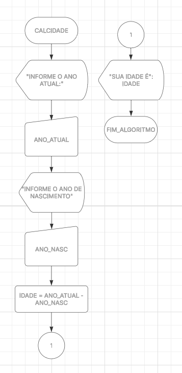
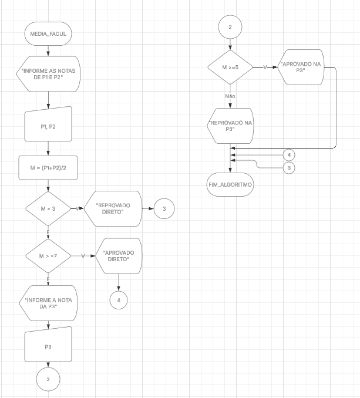
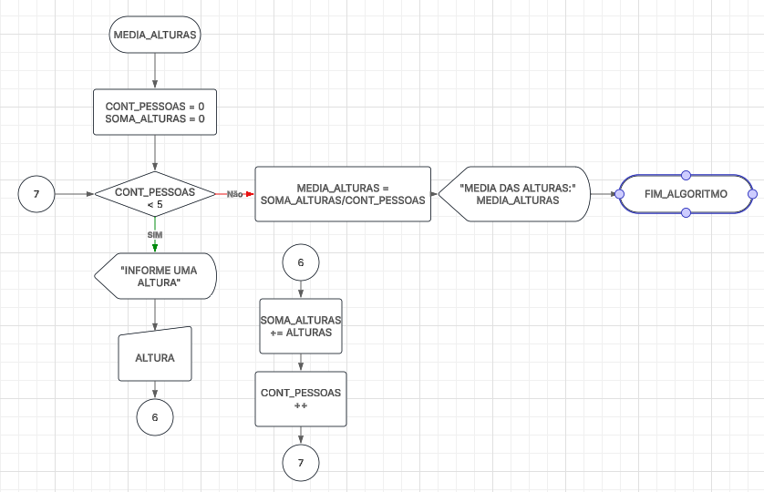

# Arquitetura de Software e Programação Orientada a Objetos.

**Gabriela Biondi**  
📧 gbiondi@fei.edu.br 

---

## Revisão de códigos de Programação Estruturada.

### Lógica Sequencial

Todas as instruções do algoritmo são executadas uma única vez.

**Ex: Calculo da idade**

### Lógica Condicional

Nem todas as instruções de um algoritmo são executadas, depende do resultado condicional (simples, completo, composto ou múltiplo).

**Ex: Aprovação do aluno**

---

### Lógica de Repetição

Um bloco de instruções pode ser executado várias vezes, dependendo de um resultado condifional. (sentinela com teste no início ou no fim, contador com teste no início ou no fim).

---

> para casa:

1- Escreva um algoritmo que calcule o salário de um funcionário multiplicando o seu valor/hora pela quantidade de horas trabalhadas.

2- Escreva um algoritmo que receba N números do usuário, e os apresente em ordem crescente.

3- Escreva um algoritmo que receba N numeros do usuário, até que seja informado o número zero. No final, apresente a soma de todos os números digitados.

> Obs: Resolvidos no LucidChart
